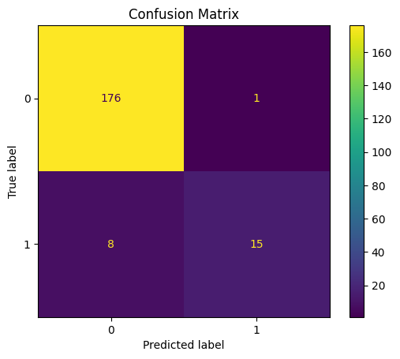

# Flight Delay Prediction Project

## Project Overview
This project builds a machine learning model to predict whether a flight will be delayed or not delayed. The goal was to take raw flight data, clean it, create a target variable, select useful features, and train a model that can classify flights into two categories:

- 0 = not delayed
- 1 = delayed

For this project, a flight was considered delayed if its arrival delay was more than 15 minutes.

## Project Goal
The main goal of this project was to create a simple and working flight delay prediction model. This project focuses on binary classification, which means the model only predicts whether a flight is delayed or not delayed.

This is the MVP (Minimum Viable Product) version of the project, meaning it is the simplest complete version that works.

## Dataset
The dataset came from U.S. flight on-time data files. Multiple flight data files were downloaded and combined into one dataset so all of the flight records could be analyzed together.

After combining the files, the data was cleaned and prepared for modeling.

## Target Variable
The target variable for this project is:

- `is_delayed`

It was created using the `ARR_DELAY` column:

- `is_delayed = 1` if `ARR_DELAY > 15`
- `is_delayed = 0` otherwise

This made the problem a binary classification problem.

## Data Cleaning
Several cleaning steps were completed before training the model:

1. Combined multiple flight data files into one file
2. Removed canceled flights
3. Removed diverted flights
4. Removed rows with missing arrival delay values
5. Created the `is_delayed` target column
6. Converted important columns to numeric values
7. Removed rows with missing values in key columns
8. Removed duplicate rows
9. Saved the final cleaned dataset

This made the data more accurate, consistent, and ready for modeling.

## Feature Selection
Different feature sets were tested during the project. The final feature set that produced the best overall results was:

- `DEP_DELAY`
- `TAXI_OUT`
- `AIR_TIME`
- `DISTANCE`

These were used as the predictor variables for the final model.

The target column remained:

- `is_delayed`

## Model Used
The final model used in this project was:

- Logistic Regression

Logistic regression was chosen because it is a strong baseline model for binary classification problems and works well for predicting two possible outcomes.

## Model Preparation
Before training the model:

- The selected features were separated into `X`
- The target variable was separated into `y`
- The data was split into training and testing sets

This created:

- `X` = input features
- `y` = target labels

The data was split as follows:

- Training set: 799 flights
- Testing set: 200 flights

## Final Results
The final model achieved the following results:

- Accuracy: 0.955

### Confusion Matrix
    [[176   1]
     [  8  15]]

The model achieved 95.5% accuracy on the test set. It performed very well at identifying flights that were not delayed and showed strong precision for delayed flights, although it still missed some actual delays.

This means:

- 176 flights were correctly predicted as not delayed
- 1 flight was predicted delayed but was actually not delayed
- 8 flights were predicted not delayed but were actually delayed
- 15 flights were correctly predicted as delayed

### Classification Report
Class 0 (not delayed):
- Precision: 0.96
- Recall: 0.99
- F1-score: 0.98

Class 1 (delayed):
- Precision: 0.94
- Recall: 0.65
- F1-score: 0.77

### Interpretation
The model performed very well overall and had strong accuracy. It was especially strong at identifying flights that were not delayed. It also performed well when predicting delayed flights, although it still missed some flights that were actually delayed.

I tested other versions of the model with different feature sets, but this version gave the best overall performance, so I selected it as the final model.

## Files in the Project

### Code
- `combine_files.py` – combines raw flight files into one dataset
- `is_delayed.py` – creates the target variable
- `clean_data.py` – cleans the dataset
- `select_features.py` – selects the final predictor columns
- `prepare_model_data.py` – separates features and target
- `train_model.py` – trains and evaluates the logistic regression model

### Data
- `combined_flights.csv` – combined raw data
- `flights_with_target.csv` – dataset after target creation
- `clean_flights.csv` – cleaned dataset
- `selected_flights.csv` – dataset with final selected features

## How to Run the Project
Run the scripts in this order:

    python Code\is_delayed.py
    python Code\clean_data.py
    python Code\select_features.py
    python Code\prepare_model_data.py
    python Code\train_model.py

## What I Learned
Through this project, I learned how to:

- combine multiple raw data files into one dataset
- clean and prepare real-world data
- define a target variable for machine learning
- select useful features
- train a logistic regression model
- evaluate model performance using accuracy, confusion matrix, precision, recall, and F1-score

I also learned that adding more features does not always improve the model. Testing different versions helped show that a smaller and more focused feature set could perform better than a larger one.

## Future Improvements
If I continued this project, I would:

- test more feature combinations
- try other machine learning models
- improve recall for delayed flights
- use more flight data
- explore predicting exact delay time instead of only delayed vs not delayed
- test models for cancellations or severe delays

## Conclusion
This project helped me build a full machine learning workflow using real flight data. It also showed me how data cleaning, feature selection, and model evaluation all affect final performance.

